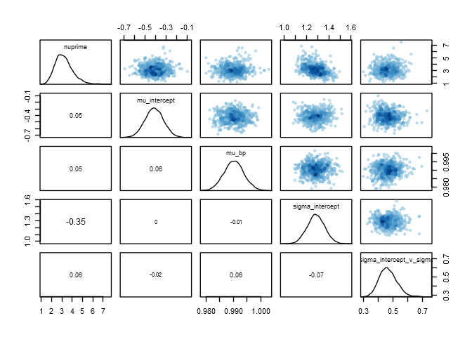
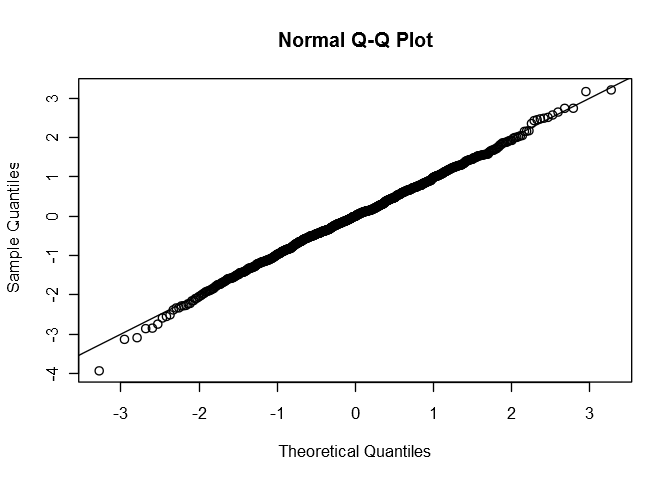
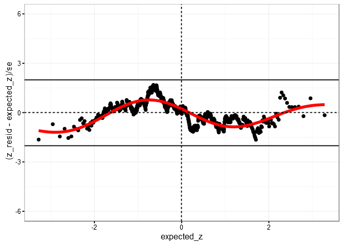
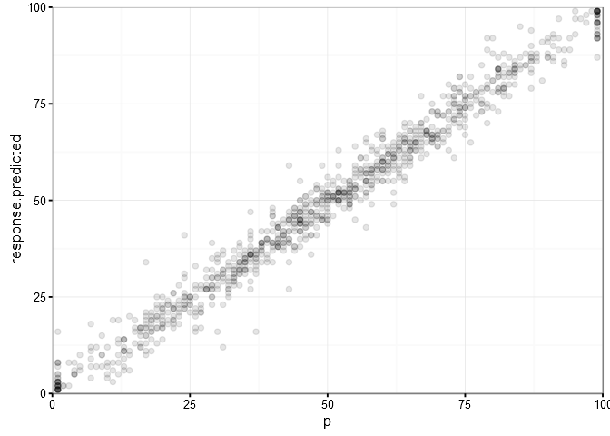

BELIV paper reanalysis with focus on bias and variance
================
Matthew Kay
July 18, 2016

-   [Setup](#setup)
    -   [Imports](#imports)
    -   [GGplot theme](#ggplot-theme)
    -   [Stan setup](#stan-setup)
-   [Load and clean data](#load-and-clean-data)
-   [Explore first](#explore-first)
-   [Bias and variance in bars](#bias-and-variance-in-bars)
    -   [A conditional distribution for responses: the discrete truncated Student t](#a-conditional-distribution-for-responses-the-discrete-truncated-student-t)
    -   [Model specification](#model-specification)
    -   [Model diagnostics](#model-diagnostics)
    -   [What do predictions look like compared to the data?](#what-do-predictions-look-like-compared-to-the-data)
    -   [Next steps](#next-steps)
        -   [Modeling the round-to-5 process](#modeling-the-round-to-5-process)
        -   [Modeling cyclical bias and variance](#modeling-cyclical-bias-and-variance)
-   [Mixture model for square pie (IN PROGRESS; IGNORE)](#mixture-model-for-square-pie-in-progress-ignore)

Based on data from `simpleviz-reanalysis.Rmd`. See also Robert Kosara's [blog post](https://eagereyes.org/blog/2016/a-reanalysis-of-a-study-about-square-pie-charts-from-2009) on this data, which discusses population mean error and bias. This is an attempt to tease apart some additional issues, like individual-level variance versus population variance, mode-unbiasedness (in contrast to mean-unbiasedness), digit preference in responses. The general thrust is to try to predict responses at the individual level.

Setup
=====

``` r
knitr::opts_chunk$set(  #default code chunk options
    dev = "CairoPNG"      #nicer PNG figures
)           
options(width=120)
```

Imports
-------

First, let's load the required libraries. The `import::from` syntax requires that the *import* package has been installed (if it has not, run `install.packages("import")`). Use `install.packages` to install any other required packages used below.

``` r
import::from(magrittr, `%>%`, `%<>%`, `%$%`)
library(dplyr)
library(ggplot2)
library(rstan)      #rstan installation can be tricky; see https://github.com/stan-dev/rstan/wiki/RStan-Getting-Started
```

We also use the following libraries available from Github, which can be installed using `devtools::install_github`:

``` r
library(rethinking)     # to install, run devtools::install_github("rmcelreath/rethinking")
library(tidybayes)      # to install, run devtools::install_github("mjskay/tidybayes")
library(metabayes)      # to install, run devtools::install_github("mjskay/metabayes")
library(dtstudent)      # to install, run devtools::install_github("mjskay/dtstudent")
```

GGplot theme
------------

``` r
theme_set(theme_bw())
#rstan ggplots have their own theme, override it
do.call(rstan_ggtheme_options, theme_get())
rstan_gg_options(fill = "skyblue4")
```

Stan setup
----------

``` r
rstan_options(auto_write = TRUE)
options(mc.cores = parallel::detectCores())
```

Load and clean data
===================

First, let's read in the data:

``` r
sv <- read.csv("data/simplevis.csv") %>%
    transmute(
        p = Value,
        response = Estimate,
        participant = ID,
        vis = Type,
        confidence = ordered(Confidence, levels=c("low","medium","high")),
        response_time = ResponseTime
    )
head(sv)
```

    ##    p response participant  vis confidence response_time
    ## 1 61       39         p01 bars     medium         35672
    ## 2 84       88         p01 bars     medium         13438
    ## 3 63       65         p01 bars     medium          6640
    ## 4 72       68         p01 bars     medium         15953
    ## 5 91       93         p01 bars     medium          7000
    ## 6 50       50         p01 bars       high          7360

Explore first
=============

Let's see the shape of people's error. We will particularly be interested in `squarepie`, which I suspect people are reading essentially as two bar charts (one for the tens column and one for the ones column), but let's start by looking at all of the responses versus the actual probability. We'll include the line `y = x` (black line) and a plain-old linear regression (red) to get a sense of the shape of things:

``` r
sv %>%
    ggplot(aes(x = p, y=response)) +
    geom_point(alpha = 0.2, size = 1) +
    geom_abline(intercept = 0, slope=1, size = .5) +
    stat_smooth(method = lm, color="red", se=FALSE) +
    facet_wrap(~vis)
```


Overall, the first impression here is that people's estimates look pretty good in all of the conditions, and that generally speaking there doesn't seem to be any big biases here: the estimates generally fall the line `y = x`. The top end of some of the conditions *might* show some underestimation, but it is not clear at this stage if that is a result of bias or variance: when you have *any* variance in the response up against a ceiling or floor (0 or 100), you should expect the mean to move away from that ceiling/floor. Thus there might be a bias in the *mean* response, but not necessarily the *mode* (most likely) response.

We're also seeing something odd in `squarepie`: there are two faint lines in the error parallel to the central line. Theses lines are at exactly `+-10` from `y = x`. One way to think of a square pie graph might be that it decomposes into two bar graphs: a vertical one representing the 10s column of `p` (0, 10, 20, ...), and a horizontal bar graph stuck on top of it representing the ones column (0, 1, 2, 3, ...). Thus, say the true value (`p`) is `36` and someone misreads the tens column as `4`, they might respond with `45` or `46` or `47`. We can see this phenomenon more easily by looking at density plots of the error (the difference between people's responses and the actual probability depicted):

``` r
sv %>%
    ggplot(aes(x = response - p)) +
    stat_density() +
    facet_wrap(~vis) +
    geom_vline(xintercept = 0, color="red") +
    coord_cartesian(xlim=c(-20,20))
```


Again we see that all of the visualizations are basically unbiased (the mode of the error---its peak---basically coincides with zero for each vis). Also note the bumps in density at +-10 for `squarepie`, corresponding to off-by-one errors in estimates of the tens column.

Bias and variance in bars
=========================

For convenience, we'll make a version of the `sv` data frame with only entries for the bars vis:

``` r
sv.bars = sv %>%
    filter(vis == "bars")
```

A conditional distribution for responses: the discrete truncated Student t
--------------------------------------------------------------------------

To build a model of people's responses, we'll want some reasonable conditional distribution for a person's responses. That is, given that I know the true value of `p` and which participant is giving me a response, what is a good probability distribution that describes the `response` I should expect *that participant* to give me?

For example, we could use a Normal distribution, which would mean that we want a model that takes in `p` and a `participant` and spits out the expected mean and standard deviation of that person's estimates of `p`. However, a straight-up normal distribution isn't the best choice because of ceiling and floor effects. The Normal distribution is defined on `[-Inf, Inf]`, but people's responses in this experiment cannot be less than 1 or greater than 99. It also isn't that robust to outliers---a few mistakes here or there (or lazy responses from an mturk participant) can drag the mean up or down fairly easily.

Instead, I will use a model that assumes people's estimates follow a discrete truncated Student-*t* distribution. An example of such a distribution is:

``` r
#make density and random number generator functions for truncated discrete t dist
mu = 2
s = 1.5
nu = 4
truncation_norm = (pTF(99.5, mu, s, nu) - pTF(0.5, mu, s, nu))

#visual explanation of truncated discrete t
mode_label_y = dnorm(mu,mu,s)/truncation_norm*1.1
mean_label_y = dnorm(mu,mu,s)/truncation_norm*1.02
normal_label_y = dnorm(2.85,mu,s)/truncation_norm
t_label_y = dTF(2.9,mu,s,nu)/truncation_norm
discrete_label_y = ddtstudent(3, nu, mu, s, lower=1, upper=99) * .92
mean. = sum(1:99 %>% {. * ddtstudent(., nu, mu, s, lower=1, upper=99)})
data_frame(
    x = -5:20,
    p = ddtstudent(x, nu, mu, s, lower=1, upper=99)
) %>%
    ggplot(aes(x = x)) +
    stat_function(fun = function(x) dTF(x, mu, s, nu) / truncation_norm, 
        geom = "area", color = NA, fill = "gray60", n = 1001) +
    stat_function(fun = function(x) ifelse(x < 0.5, dTF(x, mu, s, nu) / truncation_norm, NA),
        geom = "area", color = NA, fill = "gray85", n = 1001) +
    stat_function(fun = function(x) ifelse(x > 0.5, dnorm(x, mu, s) / truncation_norm, NA),
        color = "gray30", n = 1001) +
    stat_function(fun = function(x) ifelse(x < 0.5, dnorm(x, mu, s) / truncation_norm, NA),
        color = "gray30", linetype="dashed", n = 1001) +
    geom_vline(xintercept = 0) +
    geom_vline(xintercept = 0.5, linetype="dashed") +
    geom_segment(aes(xend = x, y = 0, yend = p), size = 1.5) +
    geom_vline(xintercept = mu, color="red", size=1) +
    geom_vline(xintercept = mean., color="blue", linetype="dashed", size=1) +
    annotate("segment", x = mu, y = mode_label_y, xend=5, yend = mode_label_y) +
    annotate("text", x = 5.1, y = mode_label_y, label="Mode", hjust=0) +
    annotate("segment", x = mean., y = mean_label_y, xend=5, yend = mean_label_y) +
    annotate("text", x = 5.1, y = mean_label_y, label="Mean", hjust=0) +
    annotate("segment", x = 2.85, y = normal_label_y, xend=5, yend = normal_label_y) +
    annotate("text", x = 5.1, y = normal_label_y, label="Truncated normal distribution", hjust=0) +
    annotate("segment", x = 2.9, y = t_label_y, xend=5, yend = t_label_y) +
    annotate("text", x = 5.1, y = t_label_y, label="Truncated Student t distribution (nu = 4)", hjust=0) +
    annotate("segment", x = 3, y = discrete_label_y, xend=5, yend = discrete_label_y) +
    annotate("text", x = 5.1, y = discrete_label_y, label="Discrete truncated Student t distribution", hjust=0) +
    xlab("response") +
    ylab("p(response)")
```


This distribution has the nice property of having its location parameterized by the mean of the corresponding untruncated distribution (which in most cases means it is parameterized by the mode), which is useful because we will be hitting ceiling/floor effects since responses in the study could not be &lt; 1 or &gt; 99. At such ceilings/floors, we might *think* people are biased if we examine their mean responses, since the mean will be shifted away from the ceiling/floor, even if their mode response might be unbiased. In the above figure, note how the dotted blue line---the mean---is further from the floor than the solid red line---the mode. The mean shifts further away from the floor the more we increase the variance, even though the mode stays in the same place:

``` r
for (s in c(1.5, 4, 8, 10)) {
    mean. = sum(1:99 %>% {. * ddtstudent(., nu, mu, s, lower=1, upper=99)})
    truncation_norm = (pTF(99.5, mu, s, nu) - pTF(0.5, mu, s, nu))
    print(data_frame(
        x = -5:20,
        p = ddtstudent(x, nu, mu, s, lower=1, upper=99)
    ) %>%
        ggplot(aes(x = x)) +
        stat_function(fun = function(x) dTF(x, mu, s, nu) / truncation_norm, 
            geom = "area", color = NA, fill = "gray60", n = 1001) +
        stat_function(fun = function(x) ifelse(x < 0.5, dTF(x, mu, s, nu) / truncation_norm, NA),
            geom = "area", color = NA, fill = "gray85", n = 1001) +
        stat_function(fun = function(x) ifelse(x > 0.5, dnorm(x, mu, s) / truncation_norm, NA),
            color = "gray30", n = 1001) +
        stat_function(fun = function(x) ifelse(x < 0.5, dnorm(x, mu, s) / truncation_norm, NA),
            color = "gray30", linetype="dashed", n = 1001) +
        geom_vline(xintercept = 0) +
        geom_vline(xintercept = 0.5, linetype="dashed") +
        geom_segment(aes(xend = x, y = 0, yend = p), size = 1.5) +
        geom_vline(xintercept = mu, color="red", size=1) +
        geom_vline(xintercept = mean., color="blue", linetype="dashed", size=1) +
        xlab("response") +
        ylab("p(response)")
    )
}
```


As a result, what looks like bias when we examine the mean may actually be variance in responses if we instead consider bias with respect to the mode. Increasingly I have come to believe that mode-unbiasedness is a more useful property to talk about in these kinds of tasks than the more commonly (usually implicit discussed) mean-unbiasedness, because with almost any meaningful variance near a ceiling or floor *any* process will appear to have a biased mean, but may not have a biased mode.

To deal with outliers, I employ a Student t distribution intead of a Normal distribution. This is a common "quick-and-dirty" way to get robust regression: compared to the Normal distribution, the Student t distribution has fatter tails. This means that we *expect* to see more observations off in the tails away from the mode, so when those observations show up they don't drag our mode as far towards them as would happen if we assumed responses were Normally distributed. In fact, we can parameterize tail fatness---that is, learn how likely we should find outliers to be: here, `nu`, sometimes called the *degrees of freedom*, determines how fat tails are. When `nu` is closer to 0, the tails are fatter; as `nu` goes to infinity the t distribution becomes the Normal distribution. (I will actually use an alternative parameterization of the Student t dsitribution in terms of standard deviation and `nuprime`, where `nuprime = nu + 2` in the usual parameterization, and with the restriction `nuprime > 0`, i.e. `nu > 2`. Because the variance of the t distribution is not finite for `nu <= 2`, this alternative parameterization ensures the response distribution has finite variance, and also tends to converge more easily).

To deal with the fact that responses were recorded as whole numbers, I will use discretization. This approach could also be thought of as interval censoring at +- .5 around whole numbers, or as measurement error---people's responses were only recorded to the nearest whole number, and this approach accounts for the error introduced by that discretization. Put another way, it assumes that for every whole number `x` from 1 to 99, any answer that would be between `x - 0.5` and `x + 0.5` would be rounded to `x`. (*N.B. later I will discuss the rounding-to-5 problem; still need to incorporate that into the model*)

I considered instead using a mode parameterization of a beta distribution, but was unable to get that to fit effectively in Stan when working with mixture models for the squarepie later on. The beta distribution also does not handle fatter tails / outliers (though I considered another modification to the beta distribution that could handle fatter tails, but also had trouble with fitting in squarepie). Probably these are my limitations and not Stan's, so I will probably return to trying out that sort of model when I get a chance.

Model specification
-------------------

Now we'll fit a model with some weakly-informed skeptical priors that assumes the mode response is some linear function of the actual value of `p`, and estimates individuals' variance and the variance of their variance (that is, assumes some people are more or less precise in their estimates than others).

``` r
fit.bars = map2stan(
    alist(
        response ~ ddtstudentSD(nuprime, mu, sigma, 
            1, #interval size
            1, #lower truncation point
            99 #upper truncation point
        ),
    
        nuprime ~ dlnorm(3, 1),

        mu <- mu_intercept + mu_bp * (p - 50) + 50,
        mu_intercept ~ dnorm(0, 2.5),
        mu_bp ~ dnorm(1, 0.5),
    
        log(sigma) <- sigma_intercept + sigma_intercept_v[participant],
        sigma_intercept ~ dnorm(-1, 1),
        sigma_intercept_v[participant] ~ dnorm(0, sigma_intercept_v_sigma),
        sigma_intercept_v_sigma ~ dnorm(0, 1.15)
    ),
    data = sv.bars,
    iter = 2000, chains = 4, cores = 4, 
    start = list(nuprime = 1)
)
```

Summary of the model coefficients:

``` r
precis(fit.bars)
```

    ## 48 vector or matrix parameters omitted in display. Use depth=2 to show them.

    ##                          Mean StdDev lower 0.89 upper 0.89 n_eff Rhat
    ## nuprime                  3.21   0.87       1.84       4.49  3565 1.00
    ## mu_intercept            -0.41   0.09      -0.55      -0.27  3667 1.00
    ## mu_bp                    0.99   0.00       0.98       1.00  4000 1.00
    ## sigma_intercept          1.28   0.08       1.16       1.41   998 1.01
    ## sigma_intercept_v_sigma  0.47   0.06       0.37       0.56  2863 1.00

``` r
pars = c("nuprime","mu_intercept","mu_bp","sigma_intercept","sigma_intercept_v_sigma")
stan_plot(fit.bars@stanfit, pars=pars) +
    geom_vline(xintercept = 0, col="gray75") +
    geom_vline(xintercept = 1, col="gray75", linetype="dashed") +
    coord_cartesian(xlim=c(-1,6), expand=FALSE) +
    scale_x_continuous(breaks=-1:6)
```

    ## ci_level: 0.8 (80% intervals)

    ## outer_level: 0.95 (95% intervals)

    ## Scale for 'x' is already present. Adding another scale for 'x', which will replace the existing scale.


Model diagnostics
-----------------

Pair plot of coefficients:

``` r
pairs(fit.bars, pars = pars)
```



Let's get some fitted values and residuals out from the model so we can inspect it.

``` r
fitted = sv.bars %>%
    tidy_sim(fit.bars)
```

    ## [ 100 / 1000 ]
    [ 200 / 1000 ]
    [ 300 / 1000 ]
    [ 400 / 1000 ]
    [ 500 / 1000 ]
    [ 600 / 1000 ]
    [ 700 / 1000 ]
    [ 800 / 1000 ]
    [ 900 / 1000 ]
    [ 1000 / 1000 ]

``` r
residuals = fitted %>%
    summarise(
        #randomized quantile residuals; see Dunn & Smyth 1996, http://www.statsci.org/smyth/pubs/residual.pdf
        p_resid_max = max(mean(response.predicted < response + 0.5), 1/n()),
        p_resid_min = min(mean(response.predicted < response - 0.5), (n() - 1)/n()),
        p_resid = runif(1, p_resid_min, p_resid_max),
        z_resid = qnorm(p_resid),
        mu = mean(mu),
        response.predicted = sample(response.predicted, 1)
    ) %>%
    ungroup()
```

Here's a Q-Q plot:

``` r
qqnorm(residuals$z_resid)
abline(a = 0, b = 1)
```



That shows the fit is pretty good (maybe there's some action in the tails?) But we can get a better look by using a detrended Q-Q plot by subtracting out the line y = x:

``` r
gamlss::wp(resid = residuals$z_resid)
```

    ## Warning in gamlss::wp(resid = residuals$z_resid): Some points are missed out 
    ## increase the y limits using ylim.all


The dotted lines show 95% confidence intervals, or about +- 2 standard errors. If the fit it good, our residuals will fit mostly within this band. We can further flatten out this band by dividing by standed error:

``` r
residuals %>% flatworm(z_resid, z_cubic=T, loess=F)
```



Now we can ask, does the model fit well over different values of p?

``` r
residuals %>% flatworm(z_resid, cut(p, breaks=c(0,20,40,60,80,100)), z_cubic=T, loess=F)
```


It does *okay*, ish.

We can also ask how well it fits different participants:

``` r
residuals %>% flatworm(z_resid, participant, ylim=NA, z_cubic=T, loess=F) + facet_wrap(~.cuts)
```


The many of the "worms" are within the +-2 se bands, but we definitely have people whose responses are not well-fit by this model. Probably there is some work to be done improving this model (e.g. handling digit preferences, accounting for cyclical bias and variance. More on those later).

Another way of looking at this is to ask if the predicted distribution of errors (in blue) looks similar to the actual distribution of errors (in red):

``` r
sv.bars %>%
    ggplot(aes(x = response - p)) +
    stat_density(fill=NA, color="red") +
    stat_density(aes(x=response.predicted - p), fill=NA, color="blue", data=residuals, adjust=1) +
    coord_cartesian(xlim = c(-30, 30))
```


What do predictions look like compared to the data?
---------------------------------------------------

Let's get some predictions for responses along the domain of 1 to 99:

``` r
samples = fit.bars %>%
    tidy_samples(c(mu_intercept, mu_bp, sigma_intercept, sigma_intercept_v_sigma, nuprime)[])

predictions = 
    data_frame(p = 1:99) %>%
    group_by(p) %>%
    do(cbind(., samples)) %>%
    mutate(
        sigma_intercept_v = rnorm(n(), 0, sigma_intercept_v_sigma),
        sigma = exp(sigma_intercept + sigma_intercept_v),
        mu = mu_intercept + mu_bp * (p - 50) + 50,
        response.predicted = rdtstudentSD(n(), nuprime, mu, sigma, lower=1, upper=99),
        error = response.predicted - p
    )
```

And plot the fit of our model (in red) along with a fit of a "naive" linear model (blue):

``` r
p = predictions %>%
    # select(-mu) %>% rename(mu = response.predicted) %>%
    mean_qi(mu) %>%
    ggplot(aes(x = p, y = mu)) +
    annotate("ribbon", ymin = c(-1, 99), ymax = c(1, 101), x = c(0, 100), fill="black", alpha=.1) +
    stat_smooth(aes(y = response), method=lm, data=sv.bars, fill="blue", alpha=.25, color="blue", size=1) +
    geom_point(aes(y = response), data=sv.bars, alpha=0.1) +
    geom_ribbon(aes(ymin = mu.lower, ymax = mu.upper), alpha = 0.25, fill="darkred") +
    geom_abline(intercept = 0, slope = 1, color="gray30") +
    geom_abline(intercept = -1, slope = 1, color="gray30", linetype="dashed") +
    geom_abline(intercept = 1, slope = 1, color="gray30", linetype="dashed") +
    geom_line(color="red", size=1) 
p + coord_cartesian(expand = FALSE)
```


See how the naive model (even with the small amount of variance in this data) has means pulling away from 0 / 100 at the endpoints. We can zoom in:

``` r
p + coord_cartesian(xlim=c(0,5), ylim=c(0,5), expand=FALSE)
```


``` r
p + coord_cartesian(xlim=c(48,52), ylim=c(48,52))
```


``` r
p + coord_cartesian(xlim=c(95,100), ylim=c(95,100), expand=FALSE)
```


The naive linear fit overestimates the biases at the ends of the range of data. Meanwhile our model suggests that if any biases are present, they are *probably* &lt;= about 1 percentage point in either direction (the light gray band).

Now let's compare what the true data looks like:

``` r
sv.bars %>%
    ggplot(aes(x = p, y = response)) +
    geom_point(alpha=0.1) +
    coord_cartesian(xlim=c(0,100), ylim=c(0,100), expand = FALSE)
```


To a prediction for the same set of participants from our model:

``` r
residuals %>%
    ggplot(aes(x = p, y = response.predicted)) +
    geom_point(alpha=0.1) +
    coord_cartesian(xlim=c(0,100), ylim=c(0,100), expand = FALSE)
```



Our model posterior predictions look alright, except the real data has some weird striations going on that don't show up in our predictions. Let's look by ones digit:

``` r
simplehist(sv.bars$response %% 10, xlab = "Ones digit in response")
```


Note the overrepresentation of responses ending in 0 and 5. Assuming the stimulus probabilities were uniformly distributed, we would expect people's responses also to be unless people are often rounding to the nearest 0 or 5 in their response. Let's make sure the values of `p` are uniformly distributed in the ones digit:

``` r
simplehist(sv.bars$p %% 10, xlab = "Ones digit in p")
```


They are approximately uniform.

If the digits in the responses were uniform, we should expect a 0 or 5 about 20% of the time (2/10 digits). How often do we see a 0 or 5?

``` r
mean(sv.bars$response %% 5 == 0)
```

    ## [1] 0.6229167

~60% of the time! Given that the true proportions should be ~20% 0 or 5 and ~80% everything else, we can get a back-of-the-napkin estimate for how often people are rounding to 0 or 5:

``` r
(mean(sv.bars$response %% 5 == 0) - .2) / .8
```

    ## [1] 0.5286458

About half of the time people rounding their estimates to the nearest 0 or 5. We can transform our predictions by adding a probabilistic rounding step:

``` r
residuals %>%
    mutate(response.predicted = pmin(pmax(
        ifelse(rbinom(n(),1,.53), round(response.predicted/5)*5, response.predicted),
        1), 99)
    ) %>%
    ggplot(aes(x = p, y = response.predicted)) +
    geom_point(alpha=0.1) +
    coord_cartesian(xlim=c(0,100), ylim=c(0,100), expand = FALSE)
```


These predictions look a little closer to what the actual data looks like.

Next steps
----------

### Modeling the round-to-5 process

One potential extension to this model would be to add the round-to-5 step to the model itself to better estimate how often people tend to round their responses off this way. It would also be interesting to look at whether this is a function of participant: do some people do this rounding process and others do not, or does each individual tend to report more 0s and 5s in a similar proportion, or some combination of those? A hierarchical model would help answer this question, by estimating a round-to-5 probability for each individual and also estimating the variance in the proportion of rounding-to-5 that people do. Low variance might imply everyone doing a similar rounding process, high variance might imply some people rounding a lot and others doing little rounding.

### Modeling cyclical bias and variance

There's also the question of cyclical bias and variance. People's estimates look to be a little more precise at the endpoints and in the middle (at 50) than our model predicts them to be. This makes sense: estimating the location of the endpoints and the halfway mark is probably easier: people can "see" when the bar is basically 0, basically 100, or *just* cuts the distance in half. Here are cyclical patterns in variance (as measured using MAD):

``` r
sv %>%
    group_by(p, vis) %>%
    summarise(mad = mad(response), response = mean(response), n=n()) %>%
    ggplot(aes(x = p, y=mad)) +
    geom_point(alpha = 0.2) +
    #span = 0.25 puts the loess smoothing window at a quarter of the data, which
    #should help us see cyclical patterns at that frequency
    stat_smooth(method = loess, color="red", se=FALSE, method.args=list(span=0.25)) +
    facet_wrap(~vis) + 
    geom_vline(xintercept = seq(0,100,length.out=9)) 
```


We could attempt to model this relationship, for example by making variance a function of distance from the endpoints and halfway mark; e.g. add a coefficient to the linear submodel for sigma that is multiplied by a curve like this (and maybe one harmonic of this curve):

``` r
curve(-cos(x*pi/25),xlim=c(0,100),n=1001)
```


We could also try to extend models like those proposed in [this paper](10.1037//0033-295X.107.3.500) that predict cyclical *bias* (not *variance*) in the presence of reference points to individual observations. It's hard to see, but some cyclical bias similar in shape to that predicted by the model in that paper does appear to be present in all conditions except squarepie:

``` r
sv %>%
    ggplot(aes(x = p, y=response - p)) +
    geom_point(alpha = 0.2) +
    #span = 0.25 puts the loess smoothing window at a quarter of the data, which
    #should help us see cyclical patterns at that frequency
    stat_smooth(method = loess, color="red", se=FALSE, method.args=list(span=0.25)) +
    facet_wrap(~vis) + 
    geom_vline(xintercept = seq(0,100,length.out=9)) +
    coord_cartesian(ylim=c(-10,10))
```


Mixture model for square pie (IN PROGRESS; IGNORE)
==================================================

``` r
m.squarepie.meta = metastan(
    data = {
        n : int(lower=1)                #number of obervations
        n_participant : int(lower=1)
        
        p : vector[n]
        response : vector[n]
        participant[n] : int
    },
    parameters = {
        mu_intercept : real             #intercept at p = 50 (relative to response = 50)
        mu_b_p : real                   #slope
        
        sigma_intercept : real          #average spread of responses (log-scale)
        sigma_v_participant_raw : vector[n_participant]
        
        sigma_v_participant_sd : real(lower=0)  #variance of participants' variances
        
        theta : real(lower=0, upper=1)  #probability of getting the tens column correct
        
        nu : real(lower=3)
    },
    transformed_parameters = {
        mu : vector[n]
        sigma : vector[n]
        sigma_v_participant : vector[n_participant]
        theta_k : vector[3]

        sigma_v_participant = sigma_v_participant_raw * sigma_v_participant_sd
        for (i in 1:n) {
            sigma[i] <- exp(sigma_intercept + sigma_v_participant[participant[i]])
        }

        theta_k[1] <- (1 - theta) / 2   #probability of off-by-one (below) in tens column
        theta_k[2] <- theta             #probability of getting the tens column exactly correct
        theta_k[3] <- theta_k[1]        #probability of off-by-one (above) in tens column
        
        #mode response given p. The -50 ... + 50 makes it so that mu_intercept can
        #be interpreted as the offset in the response from 50 when p = 50. It also
        #helps make sampling more efficient by making mu_intercept and m_b_p
        #uncorrelated.
        mu <- mu_intercept + mu_b_p * (p - 50) + 50
    },
    model = {
        #this implies a prior scale of between about .05 and 10
        sigma_intercept ~ normal(-0.4, 1.3)
        #prior that most people are within 10x as good or 10x as bad 
        #as the average person's precision
        sigma_v_participant_sd ~ normal(0, 1.15)
        #The next line implies sigma_v_participant ~ normal(0, sigma_v_participant_sd)
        #it is done to improve sampling. See the chapter on optimizing Stan code in the
        #Stan reference manual.
        sigma_v_participant_raw ~ normal(0, 1) 
        
        #prior on bias is around +- 5
        mu_intercept ~ normal(0, 2.5)
        #prior on slope is that it is close to 1 (this is around 1 +- 0.5, which a slope of
        #0 would essentially imply "no signal" --- that people's estimates of the response are
        #unrelated to the true p).
        mu_b_p ~ normal(1, 0.5)

        #prior on the proportion of estimates of the tens column that are correct 
        #(in the neighborhood of 85-100%). Another way to think of this is a prior that
        #the probability of an off-by-one error is about 0-15%.
        theta ~ beta(20,1)
        
        nu ~ exponential(R(1/30))
        
        #the following mess describes a mixture of three censored student-t distributions
        #that make up the likelihood for each observation. The mixture has one distribution
        #centered at mu, one at mu + 10, and one at mu - 10, to account for off-by-one errors
        #in the tens column. I use a student-t distribution with a low df (specifically 3)
        #instead of a normal distribution to account for outliers (essentially as a form of
        #robust regression). The censoring comes in two parts: interval censoring to account
        #for rounding of observations (since the responses are all whole numbers), and 
        #censoring at the endpoints to account for the bounded nature of the responses (from
        #1 to 99).
        for (i in 1:n) {
            log_p[3] : real     #temp for mixture log probabilities
    
            for (k in 1:3) {
                mu_offset : real

                if (k == 1 && mu[i] > 10) {
                    mu_offset = -10
                }
                else if (k == 3 && mu[i] < 90) {
                    mu_offset = 10
                }
                else {
                    mu_offset = 0
                }

                log_p[k] = log_diff_exp(
                    student_t_lcdf(response[i] + 0.5  | nu, mu[i] + mu_offset, sigma[i]),
                    student_t_lcdf(response[i] - 0.5  | nu, mu[i] + mu_offset, sigma[i])
                ) - log_diff_exp(
                    student_t_lcdf(99.5  | nu, mu[i] + mu_offset, sigma[i]),
                    student_t_lcdf(0.5  | nu, mu[i] + mu_offset, sigma[i])
                )

                #theta_k[k] is the probability for this portion of the mixture distribution
                log_p[k] = log_p[k] + log(theta_k[k])
            }
            target %+=% log_sum_exp(log_p)
        }
    },
    generated_quantities = {
        mu_offset : vector[n]
        k : vector[n]

        for (i in 1:n) {
            k[i] <- categorical_rng(theta_k)
            if (k[i] == 1 && mu[i] > 10) {
                mu_offset[i] = -10
            }
            else if (k[i] == 3 && mu[i] < 90) {
                mu_offset[i] = 10
            }
            else {
                mu_offset[i] = 0
            }
        }
    }
)
m.squarepie.stan = stan_model(model_code = as.character(m.meta))
```

``` r
fit.squarepie = sampling(m.stan, data = compose_data(filter(sv, vis == "squarepie"))
    # , control = list(adapt_delta = 0.9)
    # , iter = 2000 * 6
    # , thin = 6
    )
```

``` r
summary(fit, pars=c("mu_intercept","mu_b_p","sigma_intercept","sigma_v_participant_sd","nu","theta"))
precis(fit, pars=c("mu_intercept","mu_b_p","theta","sigma_intercept","sigma_v_participant_sd"))
plot(fit, pars=c("mu_intercept","mu_b_p","theta_k2","sigma_intercept","sigma_v_participant_sd"))
```

``` r
gen.trun(c(0.5,99.5), family="TF", type="both")

samples = tidy_samples(fit, c(
    mu_intercept, mu_b_p, 
    sigma_intercept,
    sigma_v_participant_sd,
    nu
    )[]) %>%
    inner_join(
        tidy_samples(fit, theta_k[..]),
        by = ".sample"
    )


fitted = 
    tidy_samples(fit, c(mu, mu_offset, sigma)[i]) %>%
    inner_join(tidy_samples(fit, nu[])) %>%
    mutate(
        predicted = rdtstudent(n(), nu, mu + mu_offset, sigma, lower=1, upper=99),
        predicted = round(predicted)
    ) %>%
    inner_join(mutate(filter(sv, vis=="squarepie"), i = 1:n()))

residuals = fitted %>%
    group_by(i, p, response, participant) %>%
    summarise(
        #randomized quantile residuals
        p_resid_max = mean(predicted < response + 0.5),
        p_resid_max = ifelse(p_resid_max == 0, 1/n(), p_resid_max),
        p_resid_min = mean(predicted < response - 0.5),
        p_resid_min = ifelse(p_resid_min == 1, (n() - 1)/n(), p_resid_min),
        p_resid = runif(1, p_resid_min, p_resid_max),
        z_resid = qnorm(p_resid),
        median_predicted = median(predicted),
        predicted = sample(predicted, 1),
        mu = mean(mu)
    ) %>%
    ungroup() %>%
    mutate(
        # z_resid = z_resid / sd(z_resid[is.finite(z_resid)]),
        residual = predicted - response
    )
```

``` r
residuals %>% flatworm(z_resid, participant, ylim=NA) + facet_wrap(~.cuts)
```

``` r
residuals %>% flatworm(z_resid)
```

``` r
residuals %>% flatworm(z_resid, p)
```

``` r
pairs(fit, pars=c("mu_intercept","mu_b_p","theta","sigma_intercept","sigma_v_participant_sd"))
pairs(fit, pars=c("sigma_intercept","sigma_v_participant_sd","sigma_v_participant[28]","sigma_v_participant[8]","sigma_v_participant[34]"))
pairs(fit, pars=c("sigma_intercept","sigma_v_participant[1]","sigma_v_participant[2]","sigma_v_participant[3]"))
```

``` r
predictions = 
    expand.grid(
        p = 1:99
    ) %>%
    group_by(p) %>%
    do({
        cbind(., samples) %>%
            group_by(.sample) %>%
            mutate(
                k = rcategorical(1, c(theta_k1, theta_k2, theta_k3))
            ) %>%
            ungroup() %>%
            mutate(
                sigma_v_participant = rnorm(n(), 0, sigma_v_participant_sd),
                sigma = exp(sigma_intercept + sigma_v_participant),
                mu = mu_intercept + mu_b_p * (p - 50) + 50,
                mu_offset = 
                    ifelse(k == 1 & mu > 10, -10,
                    ifelse(k == 3 & mu < 90, 10,
                        0)),
                predicted = rdtstudent(n(), nu, mu + mu_offset, sigma, lower=1, upper=99),
                predicted = round(predicted)
            )
    }) %>%
    mutate(error = predicted - p)
```

``` r
predictions %>%
    # filter(p %in% (1:10 * 10)) %>%
    # group_by(p) %>%
    filter(p == 50) %>%
    mutate(
        # mu = mu_intercept + mu_b_p * (p - 50) + 50,
        predicted = rdtstudent(n(), nu, mu, sigma, lower=1, upper=99)
    ) %>%
    summarise(
        above = mean(predicted > p + 10),
        below = mean(predicted < p - 10),
        theta = 1 - above - below
    )
```

``` r
sv %>%
    filter(vis == "squarepie") %>%
    ggplot(aes(x = response - p)) +
    stat_density(fill=NA, color="red") +
    stat_density(aes(x=round(predicted) - p), fill=NA, color="green", data=residuals, adjust=1)
```

``` r
fitted10 = fitted %>%
    filter(.sample %in% 15:20)
sv %>%
    filter(vis == "squarepie") %>%
    ggplot(aes(x = response - p)) +
    stat_density(fill=NA, color="black", size=1.5) +
    stat_density(aes(x=round(predicted) - p, group = .sample), fill=NA, color="blue", data=fitted10, adjust=1) +
    coord_cartesian(xlim=c(-20,20))
```

``` r
predictions %>%
    select(-mu) %>% rename(mu = predicted) %>%
    mean_qi(mu) %>%
    ggplot(aes(x = p, y = mu)) +
    geom_point(aes(y = response), data=filter(sv, vis=="squarepie"), alpha=0.1) +
    geom_ribbon(aes(ymin = mu.lower, ymax = mu.upper), alpha = 0.25) +
    geom_abline(intercept = 0, slope = 1, color="gray50") +
    geom_line(color="red")
```

``` r
predictions %>%
    filter(.sample %in% 1:1000) %>%
    ggplot(aes(x = p, y = round(predicted))) +
    geom_point(alpha=0.05)
```

``` r
residuals %>%
    ggplot(aes(x = p, y = predicted)) +
    geom_point(alpha=0.1)
```
